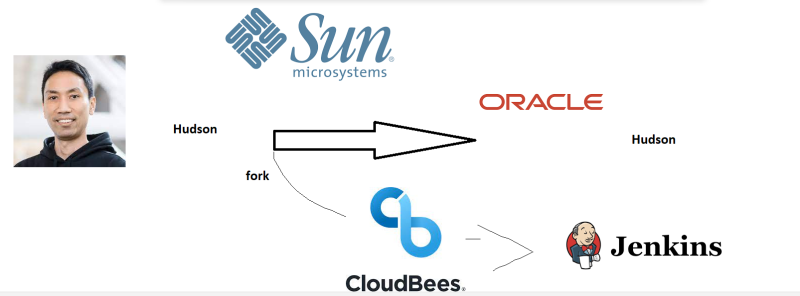
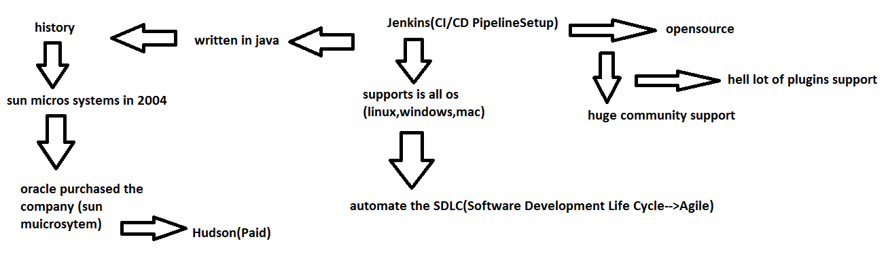
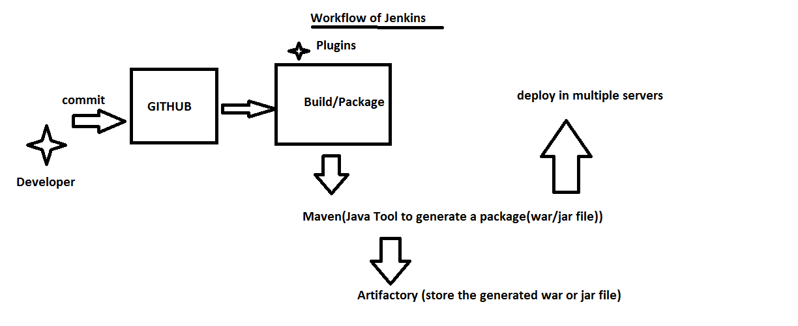
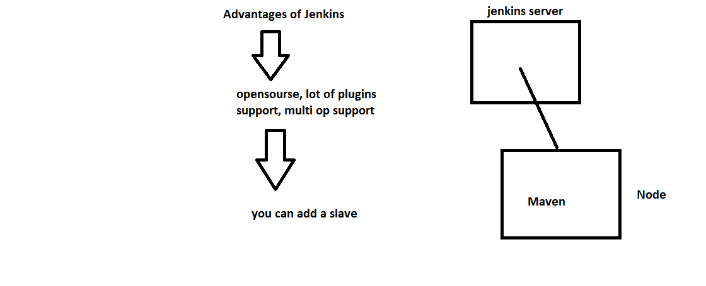
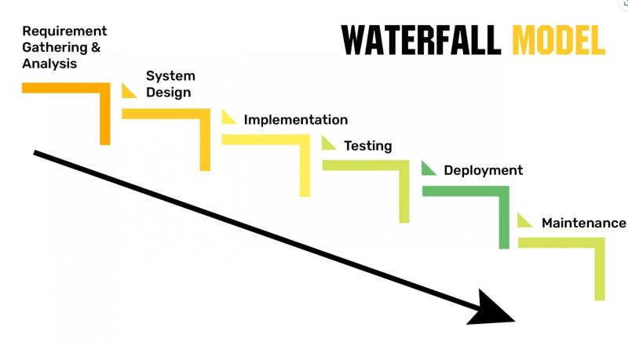
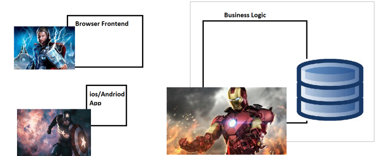
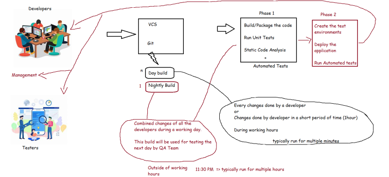

### Jenkins
* Story Of Jenkins

## Need for Continuous Integration
* Traditional Software Project Lifecycle

* Big Code Integrations, were used by teams traditionally to combine components as each component was built by teams in isolation.

* Results of Big Code Integration

*  Continuous Integration (CI): In this we integrate all the components of the application from day 1. Ideally whenver developer pushes the code to remote repository we need to perform integration.
* To check whether CI is successful or not a small set of automated tests were developed i.e.
  * We build all the application components
  *  integrate them and run this small set of tests which checks basic functionality of the system (Smoke Tests)
* Developers have started writing unit tests (test code which tests the application code)
To measure the accuracy of unit tests generally we need a tool which measures coverage i.e. code coverage
Code Coverage: Generally these are measure by tools
  * Line Coverage
  * branch coverage
  * symbol Coverage
* To verify the quality of code and whether it suits your organization’s coding standards, Code Reviews are conducted.
* For coding standards and best practices we can use tools. The failures represented by these tools are generally referred as
  * Technical debt
  * Code Smell
* The tool for running tests is called as test harness tool or popularly know as test runners. For running unit tests
  * junit (java)
  * pytest (python)
  * jasmine (nodejs)
  * nunit (c-sharp)

* To check code coverage and code qualilty we have a tool which are generally referred as Static Code Analysis Tools. We will be using Sonar Qube
* We need a tool which whenever a code is pushed to vcs, builds the code, runs the unit tests and also generates Static Code Analysis report. These tools are referred as CI/CD Engines. Some of the popular CI/CD Engines are

    * Jenkins
    * Azure DevOps Pipelines
    * Travis CI
    * Team City
    * Bamboo

* Build and Artifact
   * Build represents a format/package into which your application code is transformed to run on enduser systems.
   * To Generate Package we need to perform certain steps
        * compile
        * package

## Continuous Integration/Delivery/Deployment using CI/CD Engines
* Importance of Day builds and Night Builds 

* During the build process
    * Get the current latest version from git
    * Build/Package the code
        * This is technology specific
            * Java => ANT, MAVEN, GRADLE
            * Dotnet => msbuild
            * nodejs => Gulp
            * python
            * ruby
        * Possible outcomes:
            * Build Successful
            * Build failed
    * Run the unit-tests => Technology specific
        * Possible outcomes:
            * Unit tests passed
            * Unit tests failed
    * Static Code Analysis => Many options
        * Possible outcomes:
            * We might get corrections that can be made
            * All the code is good
* Hint: As a DevOPs Engineer the minimum knowledge which you need to have is

    * How to execute build/packaging the code (from command line)
    * How to run unit tests (from command line)
    * How to perform static code analysis

