### Paramitarized Build
*  If you want to give an option to the user who is building the jobs, then we call these variables are parameters.
* Lets look at free style project

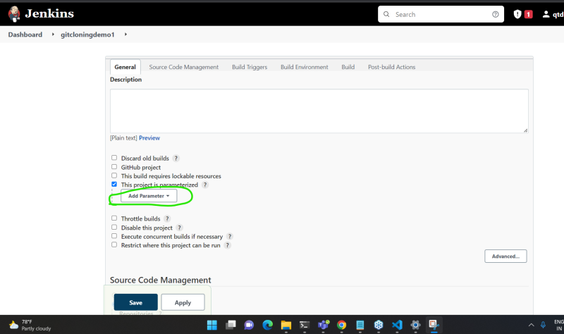

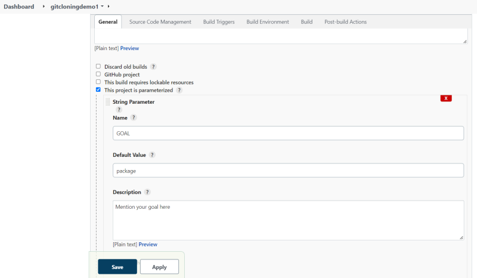

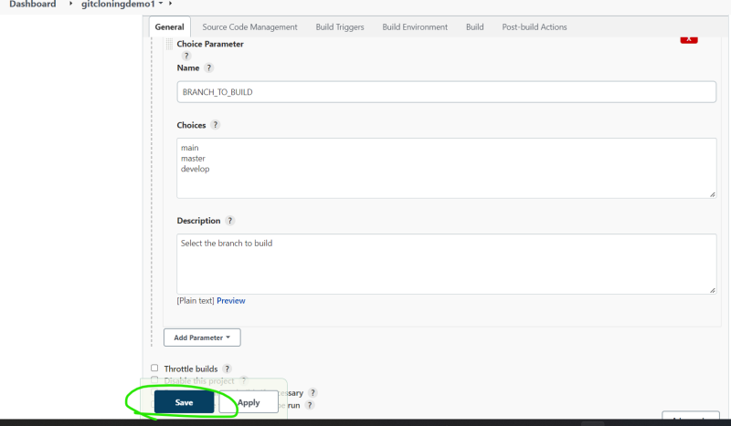

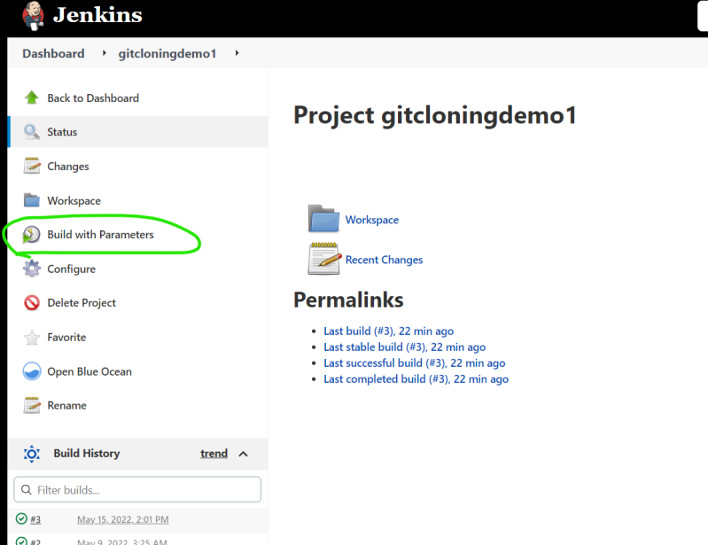

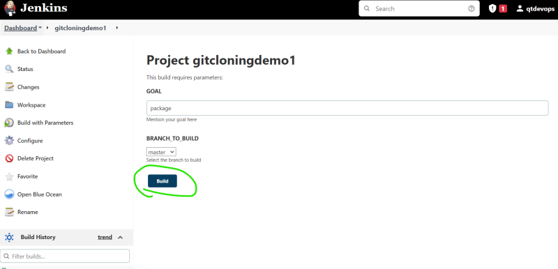

* Adding parameter to declartive pipeline

```
pipeline {
    agent any
    tools {
        // Install the Maven version configured as "M3" and add it to the path.
        maven "M3"
    }
    options { 
        timeout(time: 1, unit: 'HOURS')
        retry(2) 
    }
    triggers {
        cron('0 * * * *')
    }
    parameters {
        choice(name: 'GOAL', choices: ['compile', 'package', 'clean package'])
    }
    stages {
        stage('Source Code') {
            steps {
                git url: 'https://github.com/devops-easy/spring-petclinic.git', 
                branch: 'master'
            }

        }
        stage('Build the Code') {
            steps {
                sh script: 'mvn clean package'
            }
        }
        stage('reporting') {
            steps {
                junit testResults: 'target/surefire-reports/*.xml'
            }

        }
    }
    post {
        success {
            // send the success email
            echo "Success"
            mail bcc: '', body: "BUILD URL: ${BUILD_URL} TEST RESULTS ${RUN_TESTS_DISPLAY_URL} ", cc: '', from: 'devops@qtdevops.com', replyTo: '', 
                subject: "${JOB_BASE_NAME}: Build ${BUILD_ID} Succeded", to: 'devopseasy@gmail.com'
        }
        unsuccessful {
            //send the unsuccess email
            mail bcc: '', body: "BUILD URL: ${BUILD_URL} TEST RESULTS ${RUN_TESTS_DISPLAY_URL} ", cc: '', from: 'devops@qtdevops.com', replyTo: '', 
                subject: "${JOB_BASE_NAME}: Build ${BUILD_ID} Failed", to: 'devopseasy@gmail.com'
        }
    }
}
```

## Upstream and downstream jobs
* Lets assume we configure the jenkins jobs in the following way

* How to acheive?
* Option 1: Post Build Actions

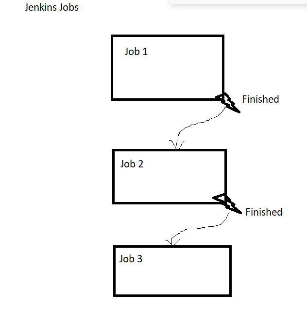

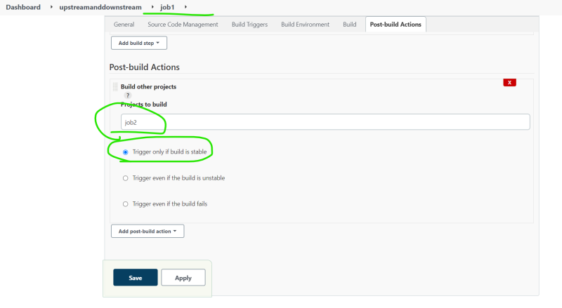

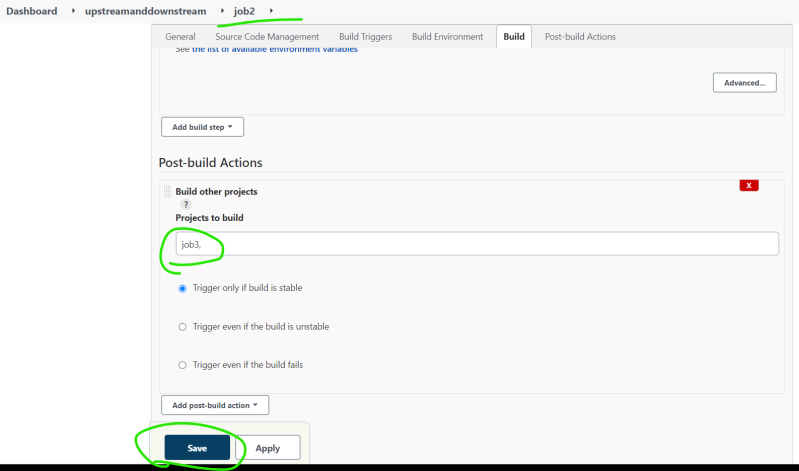

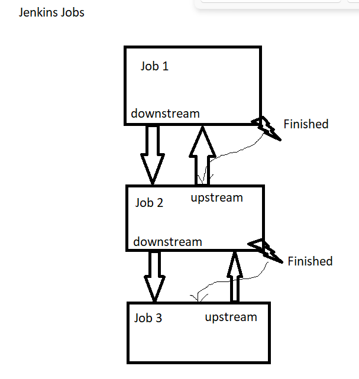

* Option 2: Build Triggers

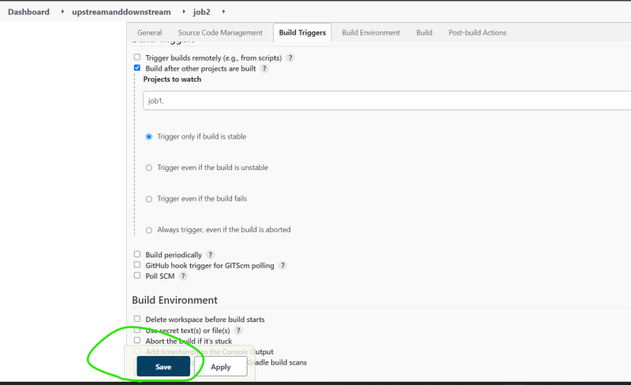

### Static Code Analysis Tools
* Analysis tools can try to suggest best practices in key areas
    * Architecture and Design
    * Comments
    * Coding Rules
    * Potential Bugs
    * Duplications
    * Unit Tests
    * Complexity
    * Sonar Qube is an open platform for managing code quality
    * There are multiple versions of sonar qube and we will be using the community edition

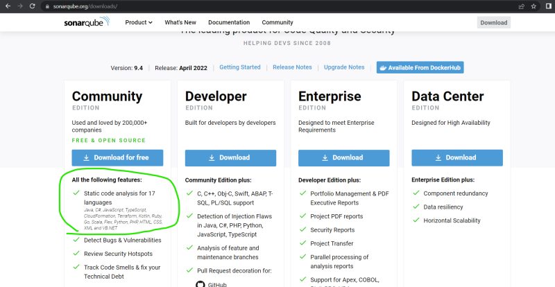

* The latest version of the sonarqube can be downloaded from here [Refer Here](https://binaries.sonarsource.com/Distribution/sonarqube/sonarqube-9.4.0.54424.zip)
* Sonar Qube requirements: [Refer Here](https://docs.sonarqube.org/latest/requirements/requirements/)
* For installing jdk 11 and postgres follow below steps
## Installing SonarQube in ubuntu
* Perform a system update and install unzip

```
sudo apt update
sudo apt install unzip -y
```
* Install Openjdk11

```
sudo apt install openjdk-11-jdk -y
```

* Install and Configure Postgres

```
sudo sh -c 'echo "deb http://apt.postgresql.org/pub/repos/apt/ `lsb_release -cs`-pgdg main" >> /etc/apt/sources.list.d/pgdg.list'
wget -q https://www.postgresql.org/media/keys/ACCC4CF8.asc -O - | sudo apt-key add -
sudo apt-get -y install postgresql postgresql-contrib
```
* Enable and Start Postgresql

```
sudo systemctl enable postgresql
sudo systemctl start postgresql
```
* Change the passwd for postgres user

```
sudo passwd postgres
```

* Switch to postgres user and create a user called sonar

```
su - postgres
createuser sonar
psql
```
* Set a password for the newly created user for SonarQube database and create a database for Postgresql database

```
ALTER USER sonar WITH ENCRYPTED password 'P@ssword';
CREATE DATABASE sonar OWNER sonar;
```
* Exit the psql shell and switch back to the user by running exit comand

```
\q
exit
```
* Download Sonarqube

```
wget https://binaries.sonarsource.com/Distribution/sonarqube/sonarqube-8.9.1.44547.zip
```
* Unzip the sonarqube using following command

```
sudo unzip sonarqube-8.9.1.44547.zip -d /opt
```
* Rename the directory

```
sudo mv /opt/sonarqube-8.9.1.44547 /opt/sonarqube
```
* Create a non sudo linux user

```
sudo adduser sonarq
```

* Assign permissions to sonarqube directory

```
sudo chown -R sonarq:sonarq /opt/sonarqube/
```
* Sonarqube uses the elastic search service so increase vm max map

```
sudo sysctl -w vm.max_map_count=262144
```

* Open the Sonarqube properties file ``` sudo nano /opt/sonarqube/conf/sonar.properties ``` and change the following properties

```
sonar.jdbc.username=sonar
sonar.jdbc.password=P@ssword
sonar.jdbc.url=jdbc:postgresql://localhost/sonar
sonar.web.javaAdditionalOpts=-server
```
* Configure Sonarqube as service

```
sudo nano /etc/systemd/system/sonar.service
```
* Add the following content to sonar.service

```
[Unit]
Description=SonarQube service
After=syslog.target network.target

[Service]
Type=forking

ExecStart=/opt/sonarqube/bin/linux-x86-64/sonar.sh start
ExecStop=/opt/sonarqube/bin/linux-x86-64/sonar.sh stop

User=sonarq
Group=sonarq
Restart=always

[Install]
WantedBy=multi-user.target
```
* Now enable and start sonarqube

```
sudo systemctl enable sonar
sudo systemctl start sonar
sudo systemctl status sonar
```
* Now access the sonarqube with the ip address of the server ``` http://<ipaddress>:9000 ```. Login into sonarqube with default credentails ``` username: admin ``` and ``` password: admin ```


* After installing [Refer Here](https://www.fosstechnix.com/how-to-install-sonarqube-on-ubuntu-22-04-lts/) and changing the password of the sonarqube generate the token

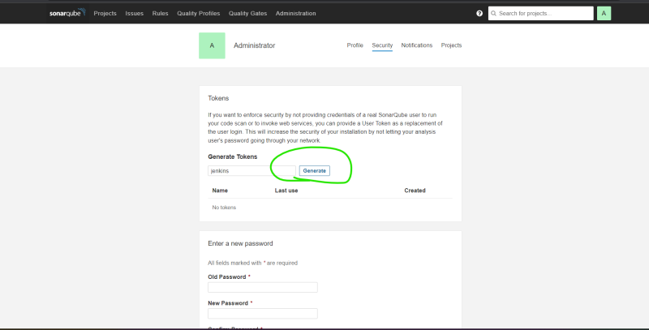

* Lets configure Sonarqube with Jenkins

```
download sonarqube scanner plugin, got to manage jenkins-configure system
```
* [Refer Here](https://www.jenkins.io/doc/pipeline/steps/sonar/#withsonarqubeenv-prepare-sonarqube-scanner-environment) for the sonar qube pipeline configuration.
* The pipeline we have configured is

```
pipeline {
    agent any
    tools {
        // Install the Maven version configured as "M3" and add it to the path.
        maven "M3"
    }
    options { 
        timeout(time: 1, unit: 'HOURS')
        retry(2) 
    }
    triggers {
        cron('0 * * * *')
    }
    parameters {
        choice(name: 'GOAL', choices: ['compile', 'package', 'clean package'])
    }
    stages {
        stage('Source Code') {
            steps {
                git url: 'https://github.com/devops-easy/spring-petclinic.git', 
                branch: 'master'
            }

        }
        stage('Build the Code and sonarqube-analysis') {
            steps {
                withSonarQubeEnv('SONAR_LATEST') {
                    sh script: "mvn ${params.GOAL} sonar:sonar"
                }

            }
        }
        stage('reporting') {
            steps {
                junit testResults: 'target/surefire-reports/*.xml'
            }
        }

    }

}
```

* Now lets do sonarqube analysis for openmrs-core

```
pipeline {
    agent any
    tools {
        // Install the Maven version configured as "M3" and add it to the path.
        maven "M3"
    }
    options { 
        timeout(time: 1, unit: 'HOURS')
        retry(2) 
    }
    triggers {
        cron('0 * * * *')
    }
    parameters {
        choice(name: 'GOAL', choices: ['compile', 'package', 'clean package'])
    }
    stages {
        stage('Source Code') {
            steps {
                git url: 'https://github.com/openmrs/openmrs-core.git', 
                branch: 'master'
            }

        }
        stage('Build the Code and sonarqube-analysis') {
            steps {
                withSonarQubeEnv('SONAR_LATEST') {
                    sh script: "mvn ${params.GOAL} sonar:sonar"
                }

            }
        }
        stage('reporting') {
            steps {
                junit testResults: 'target/surefire-reports/*.xml'
            }
        }

    }

}
```

* If you want build to be failed when the code analysis shows errors, we can configure Quality Gate.
* A Quality Gate can be created as per organizational standards

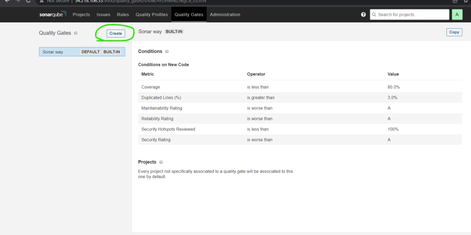

* Added wait for quality gate

```
pipeline {
    agent any
    tools {
        // Install the Maven version configured as "M3" and add it to the path.
        maven "M3"
    }
    options { 
        timeout(time: 1, unit: 'HOURS')
        retry(2) 
    }
    triggers {
        cron('0 * * * *')
    }
    parameters {
        choice(name: 'GOAL', choices: ['compile', 'package', 'clean package'])
    }
    stages {
        stage('Source Code') {
            steps {
                git url: 'https://github.com/openmrs/openmrs-core.git', 
                branch: 'master'
            }

        }
        stage('Build the Code and sonarqube-analysis') {
            steps {
                withSonarQubeEnv('SONAR_LATEST') {
                    sh script: "mvn ${params.GOAL} sonar:sonar"
                }

            }
        }
        stage('reporting') {
            steps {
                junit testResults: 'target/surefire-reports/*.xml'
            }
        }
        stage("Quality Gate") {
            steps {
              timeout(time: 1, unit: 'HOURS') {
                waitForQualityGate abortPipeline: true
              }
            }
          }

    }

}
```

## Task for upcoming sesion

### Jfrog/Artifactory installation
* [Refer Here](https://jfrog.com/community/download-artifactory-oss/) for the artifactory download
* debian/ubuntu

```
# To determine your distribution, run lsb_release -c or cat /etc/os-release
# Example:echo "deb https://releases.jfrog.io/artifactory/artifactory-pro-debs xenial main" | sudo tee -a /etc/apt/sources.list;
wget -qO - https://releases.jfrog.io/artifactory/api/gpg/key/public | sudo apt-key add -;
echo "deb https://releases.jfrog.io/artifactory/artifactory-debs {distribution} main" | sudo tee -a /etc/apt/sources.list;
sudo apt-get update && sudo apt-get install jfrog-artifactory-oss
```
* redhat

```
wget https://releases.jfrog.io/artifactory/artifactory-rpms/artifactory-rpms.repo -O jfrog-artifactory-rpms.repo;
sudo mv jfrog-artifactory-rpms.repo /etc/yum.repos.d/;
sudo yum update && sudo yum install jfrog-artifactory-oss
```
*  If you install the default credentials are admin/password
* Try to use artifactory as a free cloud version [Refer Here](https://jfrog.com/community/start-free/?isOss=true) 

