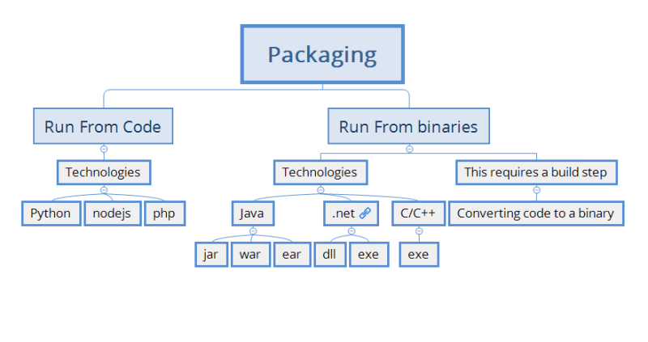
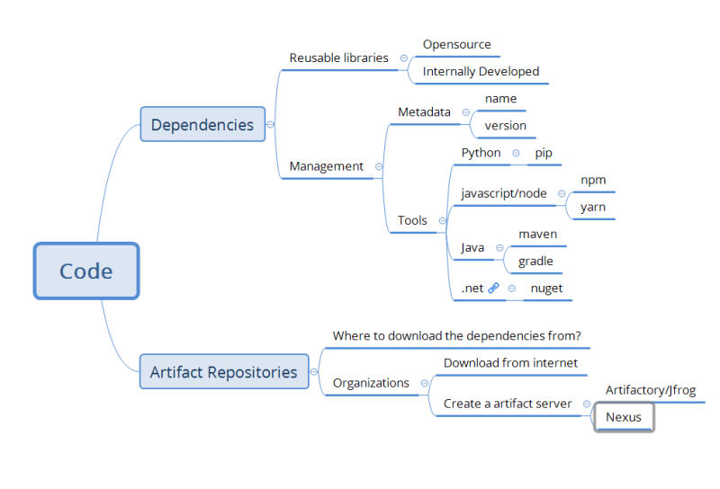
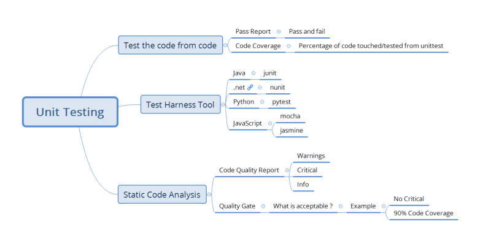
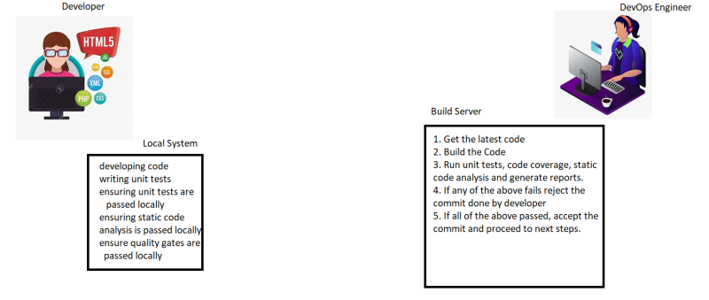

### Building/Packaging the Code
* Building the Code:

* Dependencies and Artifact Repositories:

* Unit Test:

* For your organization project:

   * How to download the dependencies
   * How to build the code and what are the tools used?
   * How to run unit tests and generate the unit test report
   * How to run the Code Coverage and generate the report
   * How to run the Static Code Analysis and generate the report
   * How to create the Quality Gate to fail the build if the code coverage or static code anlaysis is not acceptable (optional)

* Responsibilities of the DevOps Engineer on topics discussed so far

