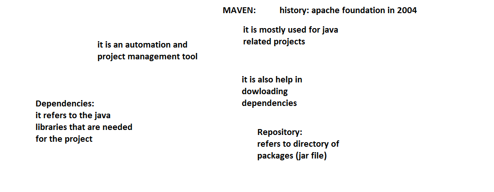
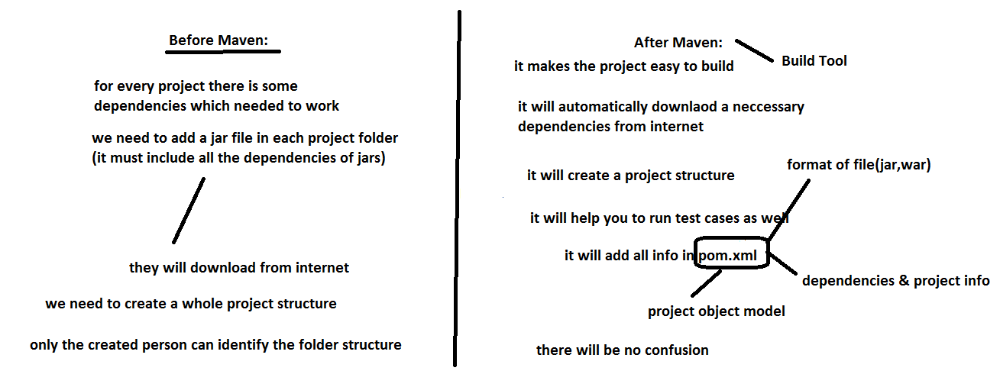
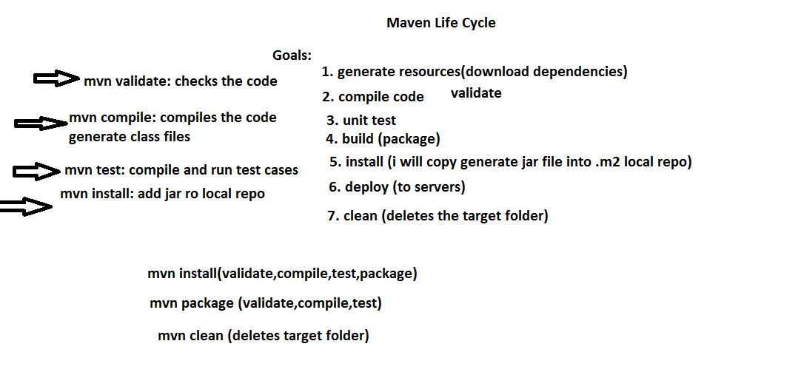
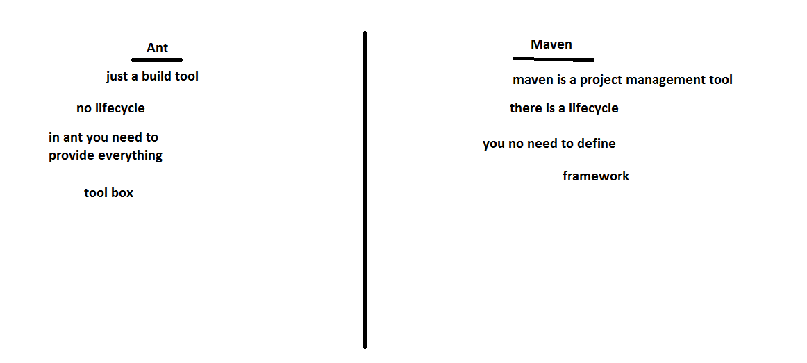

## Building Java Code with Maven
* Maven is a software project management tool (build, dependency management tool)
* This is based on the concept of project object model (POM)
* Maven provides
    * build
    * test
    * reports
    * documentation
    * releases
* Maven follows convention over configuration

| Item | Default |
|----- | ------- |
| source code | ${basedir}/src/main/java |
| Resources   |	${basedir}/src/main/resources |
| Tests       |	${basedir}/src/test |
| Compile byte code | 	${basedir}/target/classes |
| distributable (jar/war) |	${basedir}/target |

## Installing Maven
* Ensure java is installed

```
#ubuntu
sudo apt update
sudo apt install openjdk-11-jdk -y

```
* Maven can be downloaded and installed manually [Refer Here](https://maven.apache.org/download.cgi)
* Now lets use apt

```
sudo apt install maven -y
mvn --version
```
* Now lets try to install maven using tar file

```
cd /tmp
wget https://dlcdn.apache.org/maven/maven-3/3.9.3/binaries/apache-maven-3.9.3-bin.tar.gz
tar -xvzf  apache-maven-3.9.3-bin.tar.gz
sudo mv apache-maven-3.9.3 /opt/
```
* set the following environmental variables in /etc/profile.d/java.sh

```
export M2_HOME='/opt/apache-maven-3.9.3'
PATH="$M2_HOME/bin:$PATH"
export PATH
echo 'export M2_HOME=/opt/apache-maven-3.9.3' >> ~/.bashrc
echo 'export PATH=${M2_HOME}/bin:${PATH}' >> ~/.bashrc
```
* Logout & Login

```
mvn --version
```
* The developers will create the pom.xml file, but we need to understand
* When building the java project,
    * compile the code
    * run the unit tests
    * create a package
* In Maven we have goals/build phase 
    * compile => Creates .class files
    * test => runs the unit tests and generates the reports. This will also try to compile
    * package => creates the jar/war file. This will execute compile + test
    * install
    * deploy
    * clean => remove the target folder
* Maven dowloads the dependencies by default from internet [Refer Here](https://mvnrepository.com/)
* Lets compile the spring petclinic
* Maven when it downloads the dependencies, uses the folder in ``` ${HOME-DIR}\.m2 ```
* We can combine goals

```
mvn clean package
mvn compile test package
```








* Exercise: Make the jenkins build any java project using ``` mvn package ```


