## Maven contd…
* The Super POM is maven’s default pom. ALL POMs inherit froma parent or default POM.
* This Super POM contains values inherited by default

```
mvn help:effective-pom
```
* The super pom example on linux

```
<?xml version="1.0" encoding="UTF-8"?>
<!-- ====================================================================== -->
<!--                                                                        -->
<!-- Generated by Maven Help Plugin on 2022-05-12T02:45:30Z                 -->
<!-- See: http://maven.apache.org/plugins/maven-help-plugin/                -->
<!--                                                                        -->
<!-- ====================================================================== -->
<!-- ====================================================================== -->
<!--                                                                        -->
<!-- Effective POM for project                                              -->
<!-- 'org.springframework:jb-hello-world-maven:jar:0.2.0'                   -->
<!--                                                                        -->
<!-- ====================================================================== -->
<project xmlns="http://maven.apache.org/POM/4.0.0" xmlns:xsi="http://www.w3.org/2001/XMLSchema-instance" xsi:schemaLocation="http://maven.apache.org/POM/4.0.0 https://maven.apache.org/xsd/maven-4.0.0.xsd">
  <modelVersion>4.0.0</modelVersion>
  <groupId>org.springframework</groupId>
  <artifactId>jb-hello-world-maven</artifactId>
  <version>0.2.0</version>
  <properties>
    <java.version>1.8</java.version>
    <maven.compiler.source>1.6</maven.compiler.source>
    <maven.compiler.target>1.6</maven.compiler.target>
  </properties>
  <dependencies>
    <dependency>
      <groupId>joda-time</groupId>
      <artifactId>joda-time</artifactId>
      <version>2.2</version>
      <scope>compile</scope>
    </dependency>
  </dependencies>
  <repositories>
    <repository>
      <snapshots>
        <enabled>false</enabled>
      </snapshots>
      <id>central</id>
      <name>Central Repository</name>
      <url>https://repo.maven.apache.org/maven2</url>
    </repository>
  </repositories>
  <pluginRepositories>
    <pluginRepository>
      <releases>
        <updatePolicy>never</updatePolicy>
      </releases>
      <snapshots>
        <enabled>false</enabled>
      </snapshots>
      <id>central</id>
      <name>Central Repository</name>
      <url>https://repo.maven.apache.org/maven2</url>
    </pluginRepository>
  </pluginRepositories>
  <build>
    <sourceDirectory>/home/ubuntu/java-hello-world-with-maven/src/main/java</sourceDirectory>
    <scriptSourceDirectory>/home/ubuntu/java-hello-world-with-maven/src/main/scripts</scriptSourceDirectory>
    <testSourceDirectory>/home/ubuntu/java-hello-world-with-maven/src/test/java</testSourceDirectory>
    <outputDirectory>/home/ubuntu/java-hello-world-with-maven/target/classes</outputDirectory>
    <testOutputDirectory>/home/ubuntu/java-hello-world-with-maven/target/test-classes</testOutputDirectory>
    <resources>
      <resource>
        <directory>/home/ubuntu/java-hello-world-with-maven/src/main/resources</directory>
      </resource>
    </resources>
    <testResources>
      <testResource>
        <directory>/home/ubuntu/java-hello-world-with-maven/src/test/resources</directory>
      </testResource>
    </testResources>
    <directory>/home/ubuntu/java-hello-world-with-maven/target</directory>
    <finalName>jb-hello-world-maven-0.2.0</finalName>
    <pluginManagement>
      <plugins>
        <plugin>
          <artifactId>maven-antrun-plugin</artifactId>
          <version>1.3</version>
        </plugin>
        <plugin>
          <artifactId>maven-assembly-plugin</artifactId>
          <version>2.2-beta-5</version>
        </plugin>
        <plugin>
          <artifactId>maven-dependency-plugin</artifactId>
          <version>2.8</version>
        </plugin>
        <plugin>
          <artifactId>maven-release-plugin</artifactId>
          <version>2.5.3</version>
        </plugin>
      </plugins>
    </pluginManagement>
    <plugins>
      <plugin>
        <artifactId>maven-shade-plugin</artifactId>
        <version>2.1</version>
        <executions>
          <execution>
            <phase>package</phase>
            <goals>
              <goal>shade</goal>
            </goals>
            <configuration>
              <transformers>
                <transformer implementation="org.apache.maven.plugins.shade.resource.ManifestResourceTransformer">
                  <mainClass>hello.HelloWorld</mainClass>
                </transformer>
              </transformers>
            </configuration>
          </execution>
        </executions>
      </plugin>
      <plugin>
        <artifactId>maven-clean-plugin</artifactId>
        <version>2.5</version>
        <executions>
          <execution>
            <id>default-clean</id>
            <phase>clean</phase>
            <goals>
              <goal>clean</goal>
            </goals>
          </execution>
        </executions>
      </plugin>
      <plugin>
        <artifactId>maven-resources-plugin</artifactId>
        <version>2.6</version>
        <executions>
          <execution>
            <id>default-testResources</id>
            <phase>process-test-resources</phase>
            <goals>
              <goal>testResources</goal>
            </goals>
          </execution>
          <execution>
            <id>default-resources</id>
            <phase>process-resources</phase>
            <goals>
              <goal>resources</goal>
            </goals>
          </execution>
        </executions>
      </plugin>
      <plugin>
        <artifactId>maven-jar-plugin</artifactId>
        <version>2.4</version>
        <executions>
          <execution>
            <id>default-jar</id>
            <phase>package</phase>
            <goals>
              <goal>jar</goal>
            </goals>
          </execution>
        </executions>
      </plugin>
      <plugin>
        <artifactId>maven-compiler-plugin</artifactId>
        <version>3.1</version>
        <executions>
          <execution>
            <id>default-compile</id>
            <phase>compile</phase>
            <goals>
              <goal>compile</goal>
            </goals>
          </execution>
          <execution>
            <id>default-testCompile</id>
            <phase>test-compile</phase>
            <goals>
              <goal>testCompile</goal>
            </goals>
          </execution>
        </executions>
      </plugin>
      <plugin>
        <artifactId>maven-surefire-plugin</artifactId>
        <version>2.12.4</version>
        <executions>
          <execution>
            <id>default-test</id>
            <phase>test</phase>
            <goals>
              <goal>test</goal>
            </goals>
          </execution>
        </executions>
      </plugin>
      <plugin>
        <artifactId>maven-install-plugin</artifactId>
        <version>2.4</version>
        <executions>
          <execution>
            <id>default-install</id>
            <phase>install</phase>
            <goals>
              <goal>install</goal>
            </goals>
          </execution>
        </executions>
      </plugin>
      <plugin>
        <artifactId>maven-deploy-plugin</artifactId>
        <version>2.7</version>
        <executions>
          <execution>
            <id>default-deploy</id>
            <phase>deploy</phase>
            <goals>
              <goal>deploy</goal>
            </goals>
          </execution>
        </executions>
      </plugin>
      <plugin>
        <artifactId>maven-site-plugin</artifactId>
        <version>3.3</version>
        <executions>
          <execution>
            <id>default-site</id>
            <phase>site</phase>
            <goals>
              <goal>site</goal>
            </goals>
            <configuration>
              <outputDirectory>/home/ubuntu/java-hello-world-with-maven/target/site</outputDirectory>
              <reportPlugins>
                <reportPlugin>
                  <groupId>org.apache.maven.plugins</groupId>
                  <artifactId>maven-project-info-reports-plugin</artifactId>
                </reportPlugin>
              </reportPlugins>
            </configuration>
          </execution>
          <execution>
            <id>default-deploy</id>
            <phase>site-deploy</phase>
            <goals>
              <goal>deploy</goal>
            </goals>
            <configuration>
              <outputDirectory>/home/ubuntu/java-hello-world-with-maven/target/site</outputDirectory>
              <reportPlugins>
                <reportPlugin>
                  <groupId>org.apache.maven.plugins</groupId>
                  <artifactId>maven-project-info-reports-plugin</artifactId>
                </reportPlugin>
              </reportPlugins>
            </configuration>
          </execution>
        </executions>
        <configuration>
          <outputDirectory>/home/ubuntu/java-hello-world-with-maven/target/site</outputDirectory>
          <reportPlugins>
            <reportPlugin>
              <groupId>org.apache.maven.plugins</groupId>
              <artifactId>maven-project-info-reports-plugin</artifactId>
            </reportPlugin>
          </reportPlugins>
        </configuration>
      </plugin>
    </plugins>
  </build>
  <reporting>
    <outputDirectory>/home/ubuntu/java-hello-world-with-maven/target/site</outputDirectory>
  </reporting>
</project>
```
* In Maven we have goals/build phase
    * compile => Creates .class files
    * test => runs the unit tests and generates the reports. This will also try to * * compile
    * package => creates the jar/war file. This will execute compile + test
    * install => Create the jar/war file and dependency pom file in M2 Folder
    * deploy => copy the final package to the remote repository
    * clean => remove the target folder

## Build Profile

* This is set of configuration values
    * Types:
         * Per Project => Defined in the Project POM file
         * Per User => Defined in Maven settings file (~/.m2/settings.xml)
         * Global => Defined in Maven global settings file ($M2_HOME/conf/settings.xml)

## Maven Repository
* Maven repositories are of 3 types
    * local
    * central
    * remote

## Maven Plugins
* Maven is plugin execution framework, each task is executed by plugins

## Building and testing projects
* To build the project we need to create a package (compile test package)

```
mvn package
mvn compile test package
mvn clean package
```

## How to check the test results
* Test results will be in ``` ${project-dir}/target/surefire-reports ```
* Lets integrate whatever we have done so far in jenkins

### Configuring Maven in Jenkins
* There are two ways:
    * Configure maven for the jenkins user on the linux system
    * Using Jenkins Setting

    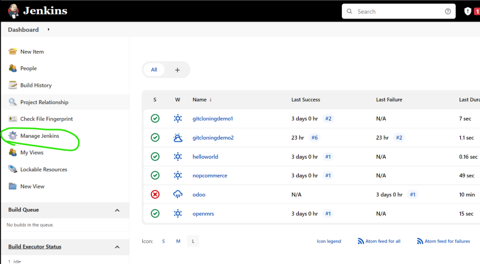

    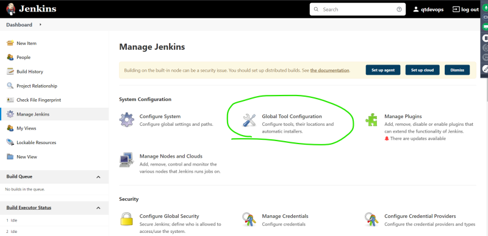

    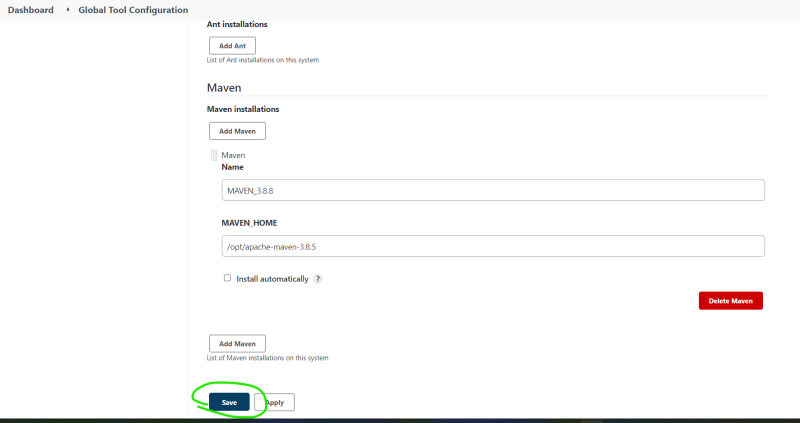

    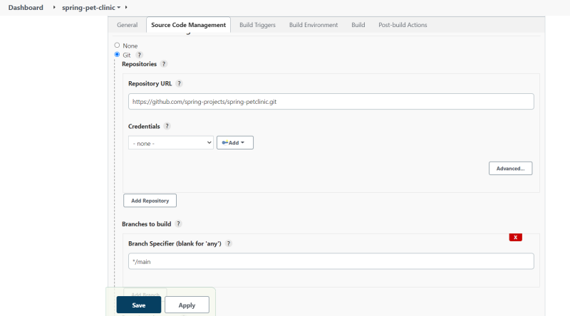

    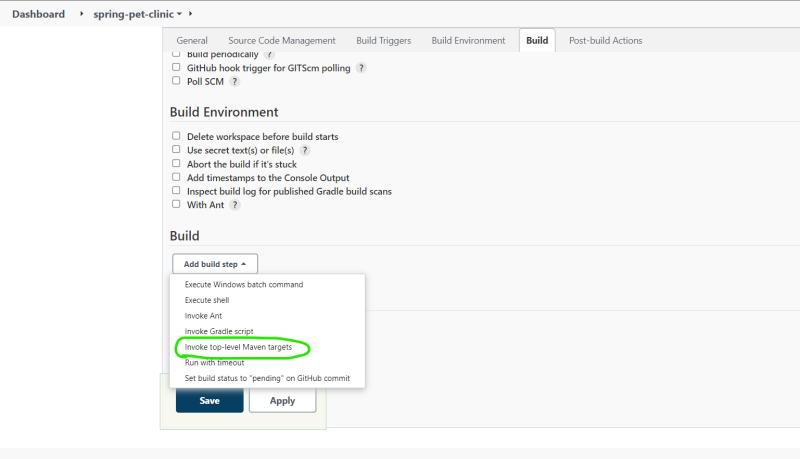

    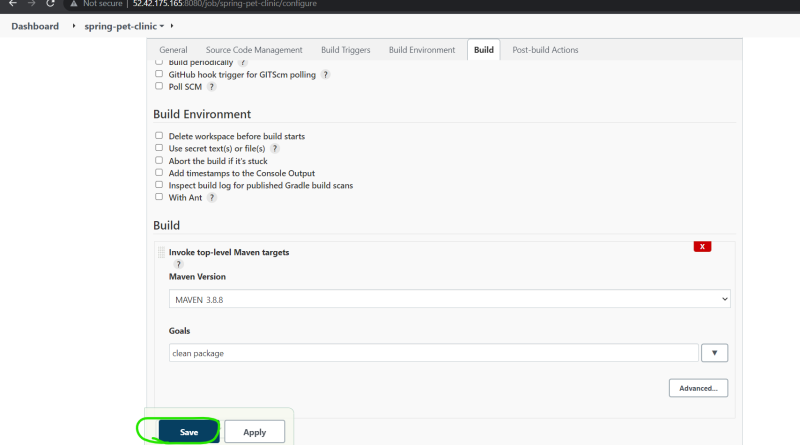

    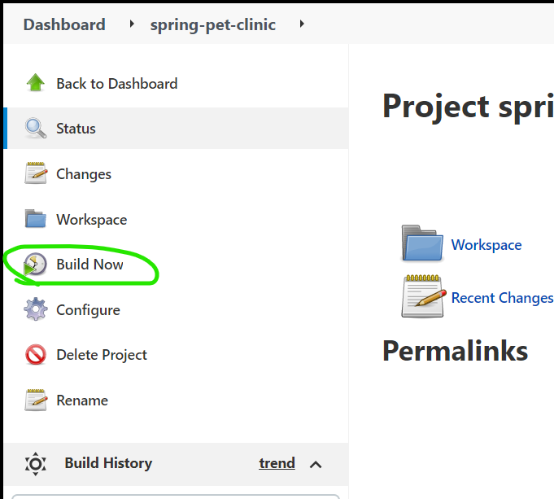

    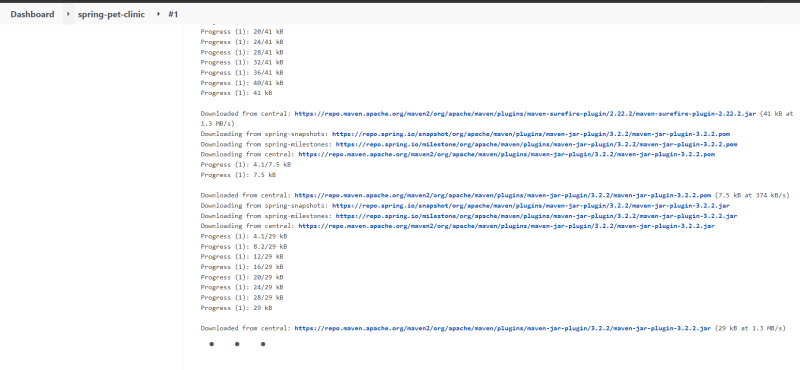

    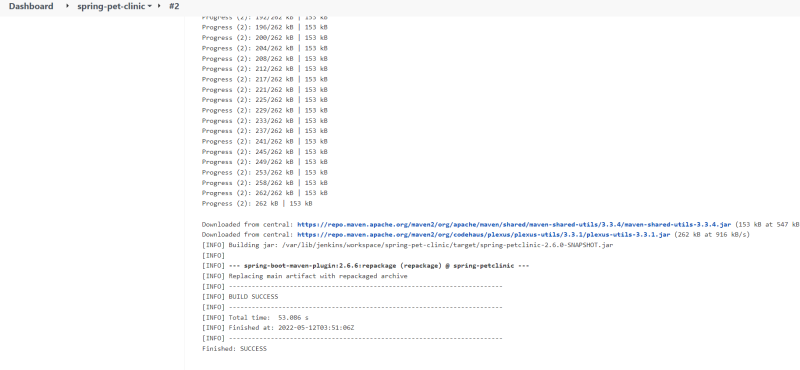

    * Lets publish junit test results

    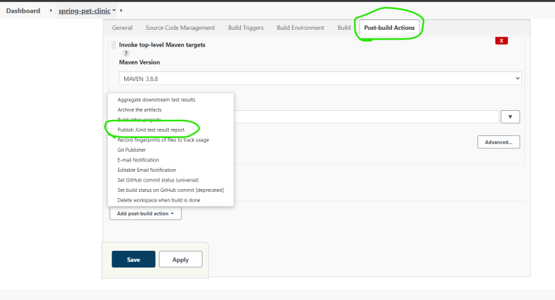

    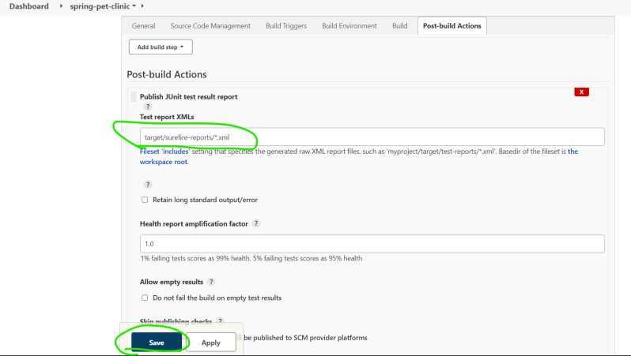

    * Now build the project

    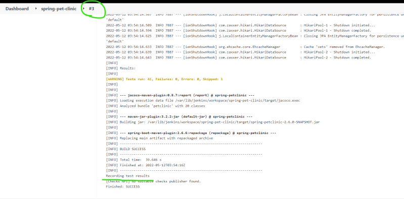

    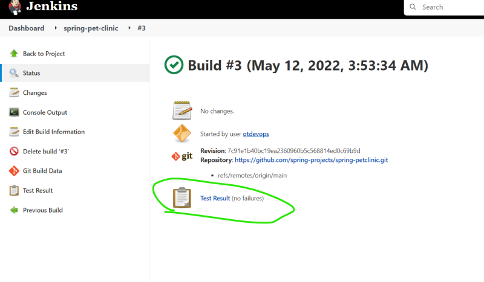

    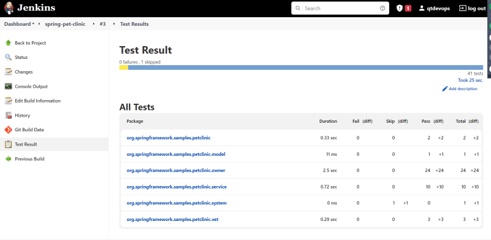

    * If we need to show the artifact (jar/war/dll/exe) and also allow the users to download that file, we need to archive the artifacts

    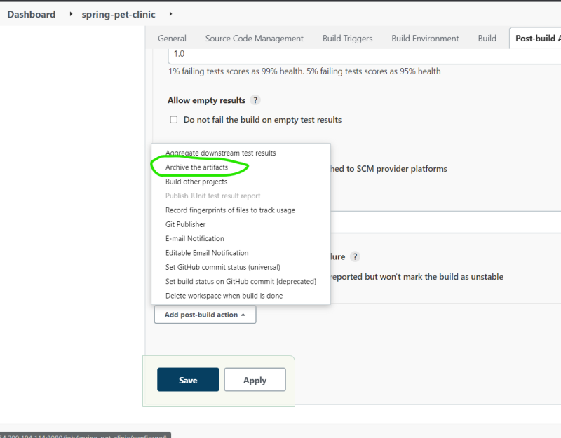

    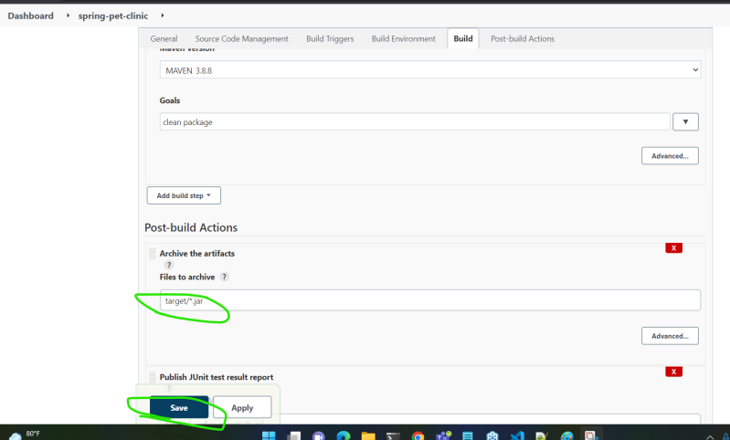

    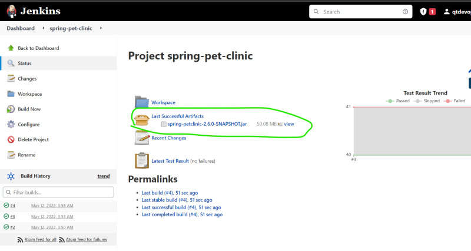


### How to perform static code Analysis
*  For this we need to install sonarqube server


