## Jenkins Project
* In Jenkins the traditional way of creating project/job is called as Free Style
* The Free Style Jenkins Job Contains the following sections
    * General
        * Basic information about project
    * Source Code Management:
        * Section for configuring SCM
    * Build Triggers:
        * Section for configuring when to start the build
    * Build Environment:
        * Has information and options to control workspace and logs
    * Build:
        * This is section used to configure the builds
    * Post Build:
        * Actions to be performed after the build is complete

* Jenkins is a plugin based tool, the Functionality to show UI to the user and converting the interaction into low level commands is done by Plugin.
* Plugins can be developed by using Java Language
* There are lot of community plugins. Plugins generally have the format of hpi (hudson plugin interface) or jpi (jenkins plugin interface)
* Before installing subversion plugin

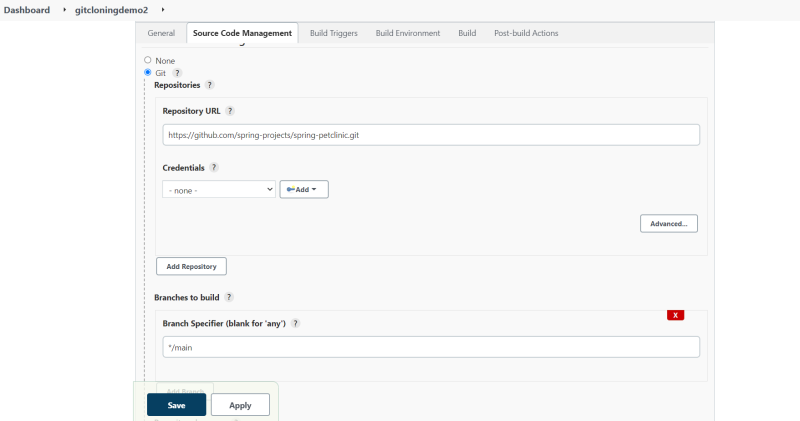

* Lets install a plugin for Subversion

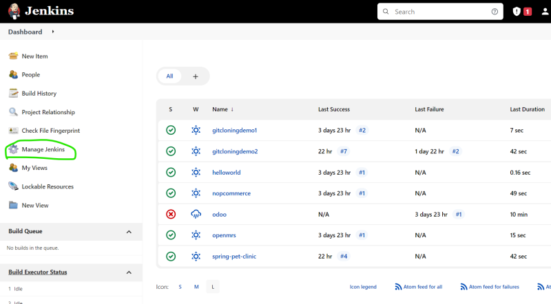

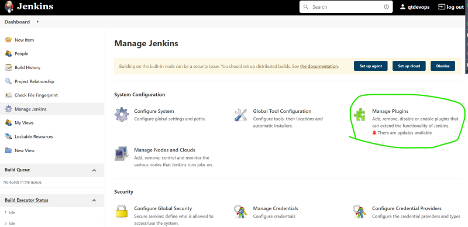

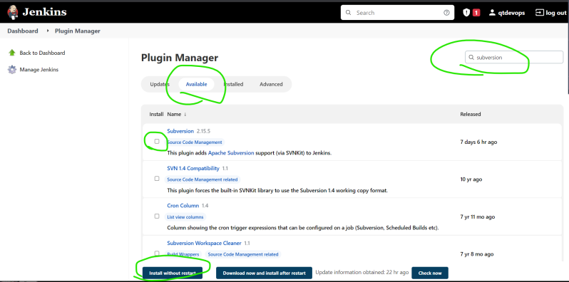

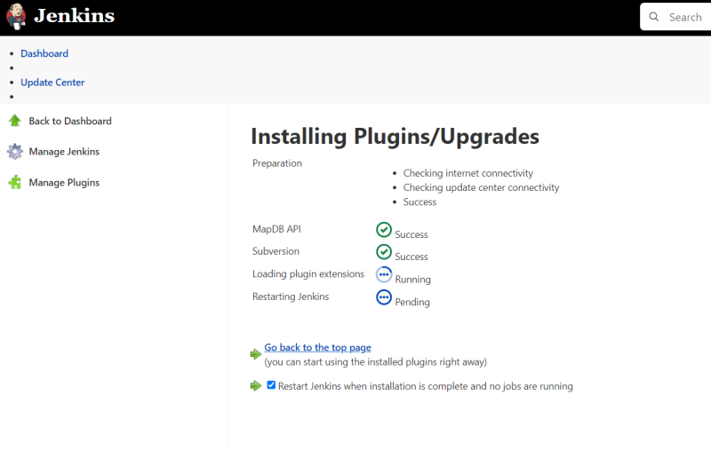

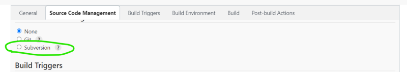

* Plugins of the jenkins are available at Refer Here
Plugins can be installed in 3 ways
  * Using the Plugins UI
  * Using the Jenkins-cli
  * Direct Upload

## Distributed Builds
* When we work with any CI/CD system, Working with one server is not possible due to various reasons
   * Projects might have different build environments
   * Every build on one server will make this a single point of failure
    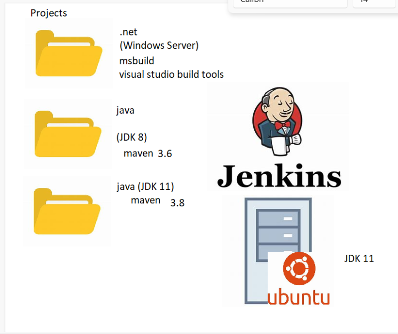
* So jenkins supports distributed builds, where we can have a jenkins master is the central server to create and configure jobs and then to run the jenkins jobs, we create jenkins nodes.
* Jenkins node is a different machine with jenkins agent in it.
* Jenkins nodes have labels and Jenkins master will try to identify the best fit node for the project based on the labels on the node.
* If the labels on the project/job match node, then jenkins will execute the job on a particular node as mentioned in the below image

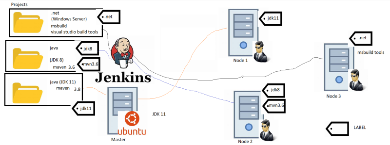

* To establish the communication between jenkins master and nodes, jenkins has by default two ways
  * Controller based
  * SSH Based

* [Refer Here](https://www.jenkins.io/doc/book/using/using-agents/) for the official docs to connect to nodes
* Lets create two more linux servers. On these server lets create a user called as jenkins and give admin permissions (sudo permission without password) 
   * In one server i will be install java 8

    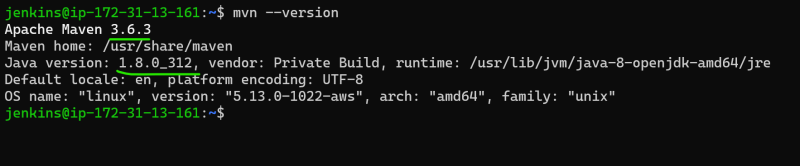

   * In other server i will be install java 11

* Now lets configure Node-1 (jdk 8 and mvn) as a node via ssh to the jenkins server
* Manage Jenkins => Manage Nodes

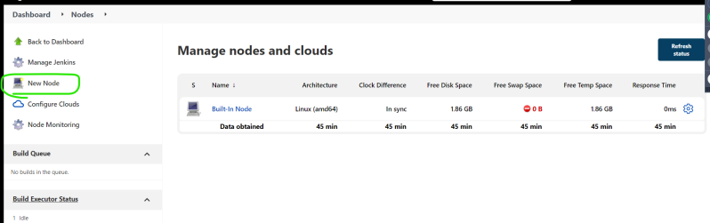

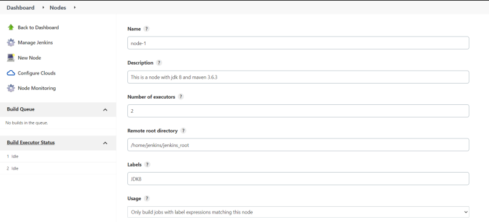

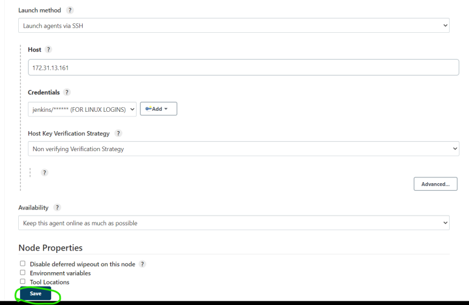

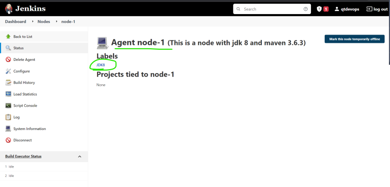

* Lets create a project to run on node-1 to build game of life [Refer Here](https://github.com/wakaleo/game-of-life). In this project i will be using the forked verson [Refer Here](https://github.com/devops-easy/game-of-life.git)

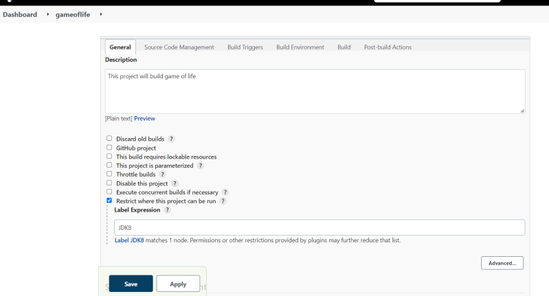

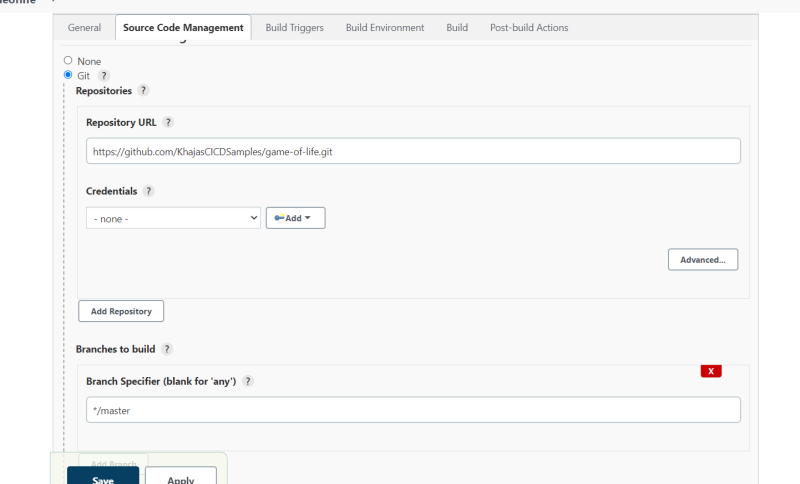

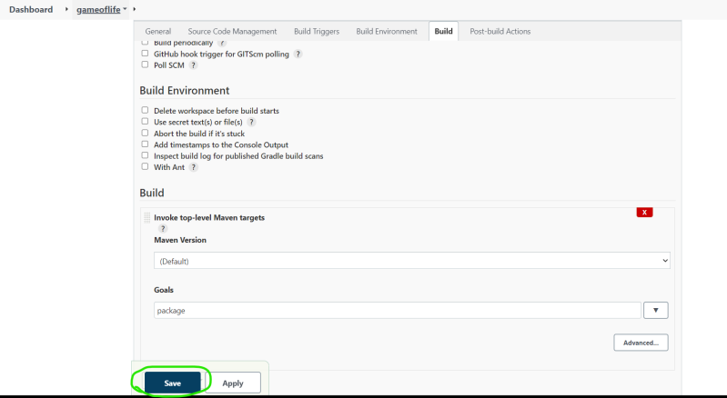

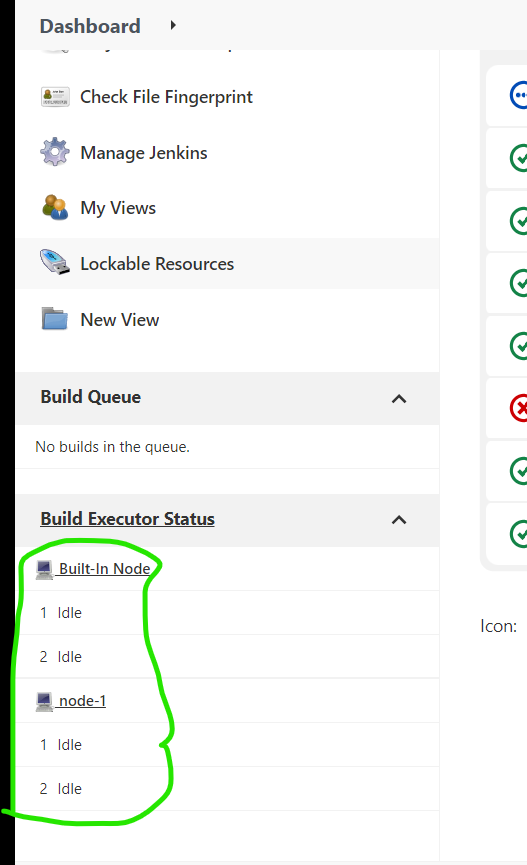

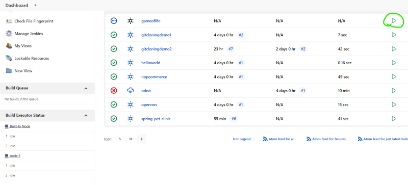

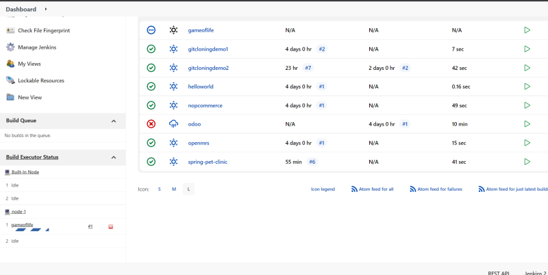

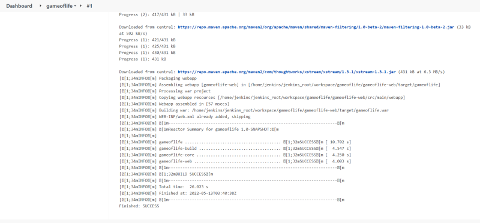

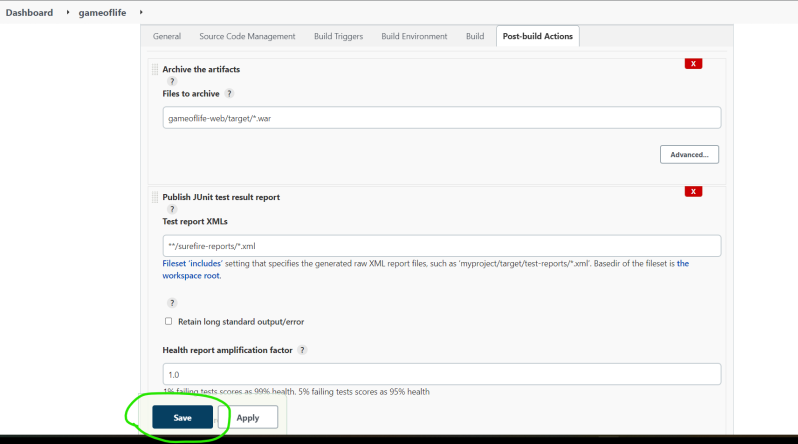

* Now lets configure the node2 with jdk11 and maven

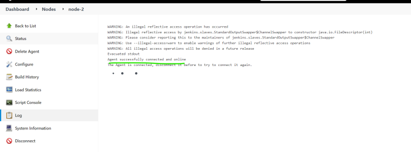

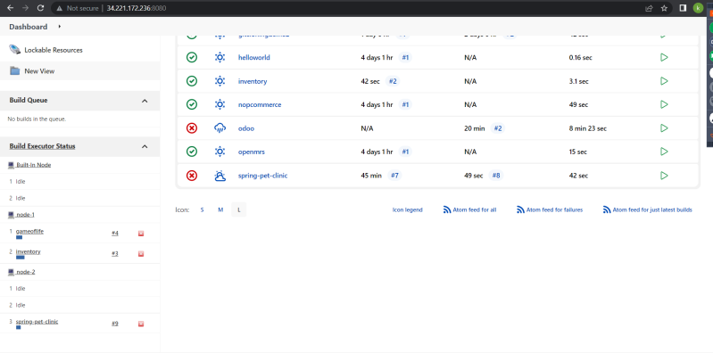

* Jenkins can run multiple projects in parallel, but one project will be assigned to only one executor

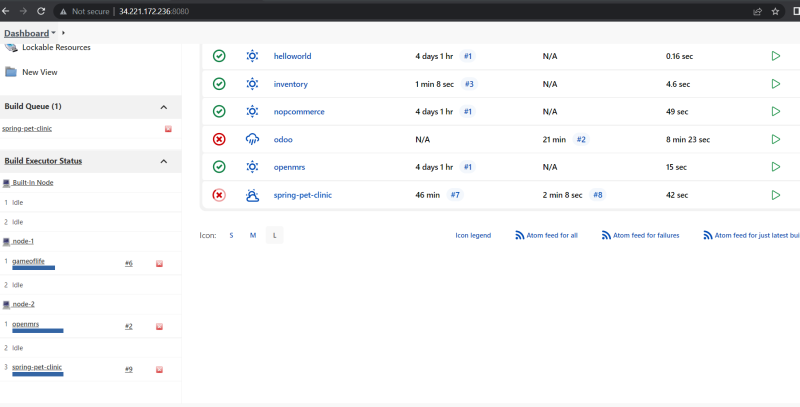

* If you want to change this, we need to configure concurrent builds

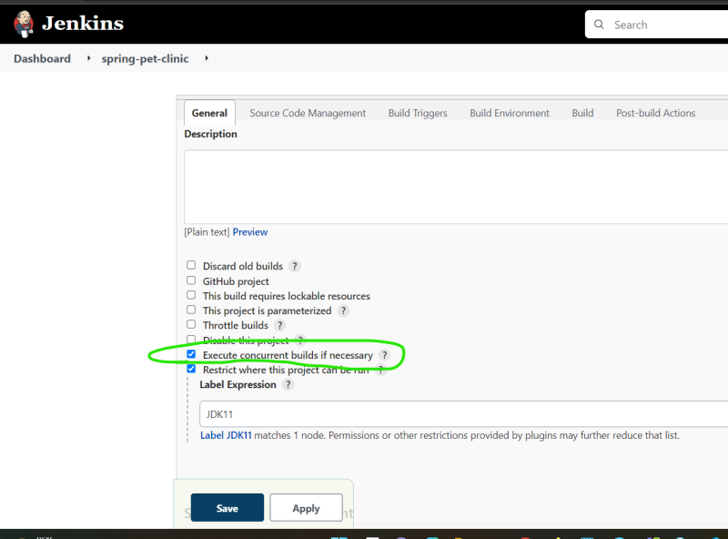

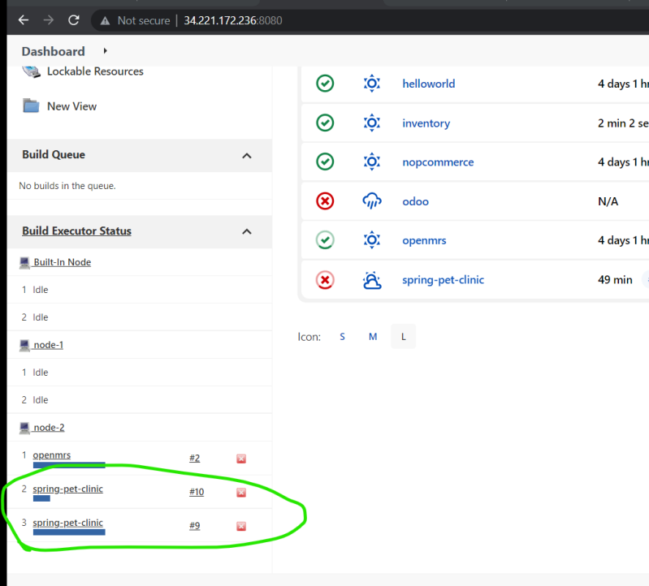

* When we execute any jenkins project a build id which is by default a running number (Start from 1 ) is assigned.