### Build Triggers
* When the project should be built?
* Generally organizations follow two types of builds 
    * Day Builds:
        * Builds done during active development
        * Two options:
            * Build for every change pushed by a developer
            * Build for every one hour or two hours in active working timings
        * We are supposed to give feedback to developer on their commit i.e. if the build is passed, unit tests are passed and code coverage is ok, Static Code Analysis etc..
        * Generally day builds are on a different branch (develop, sprint-n-develop etc…)
    * Nightly Builds:
        * Consolidated build for all the work done by dev team(s) in one day
        * Build once in a day (Scheduled when no development )
        * Build should
            * Build the code
            * Unit tests
            * Static code analysis
            * Code Coverage
            * Run automated system tests and performance tests which require application to be deployed.
                * Tests might be developed using test automation tools like
                    * Selenium
                    * JMeter
                    * Postman
                    * Loadrunner
        * Nightbuilds on different branch (RELEASE_v1.0.0_SPRINTn)

* Configuring Day Builds where a build is created for every commit:
    * Day build to be started when any developer pushes the changes to the branch
      
      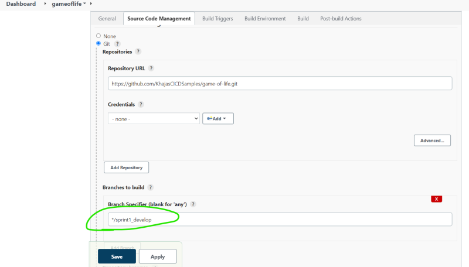

      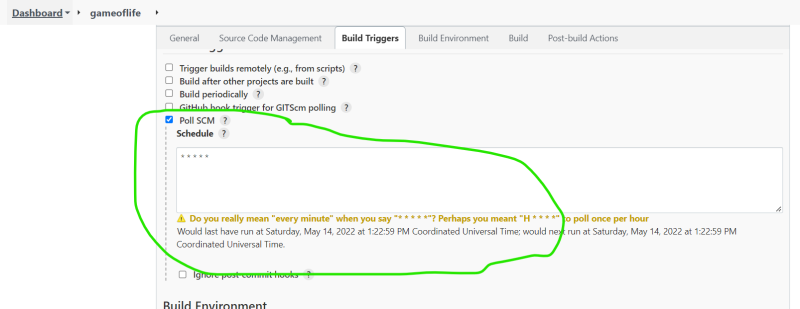

      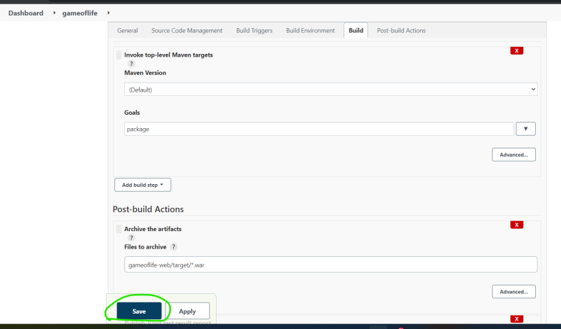

    * Now make changes and push the changes to the configured branch

     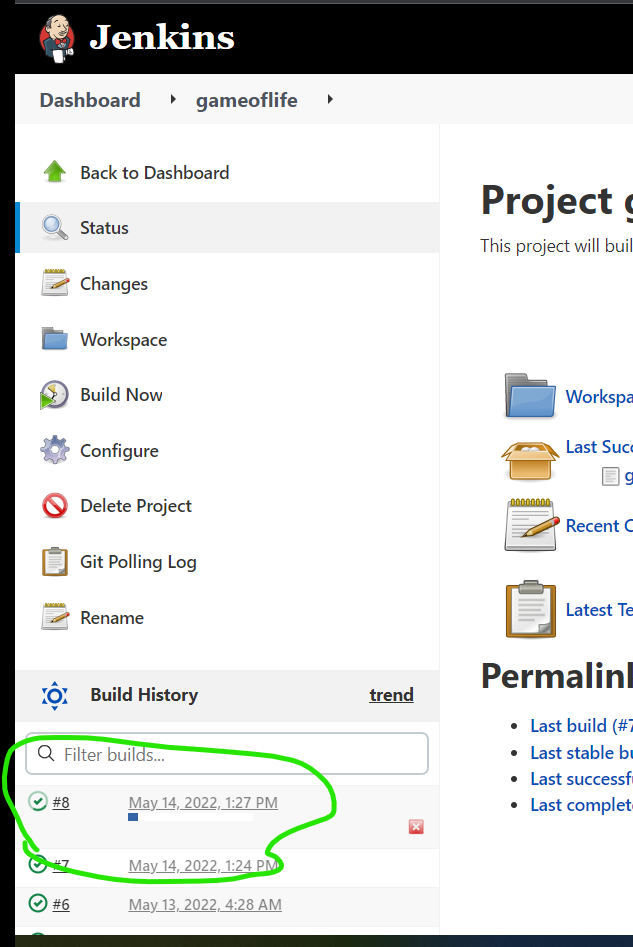

     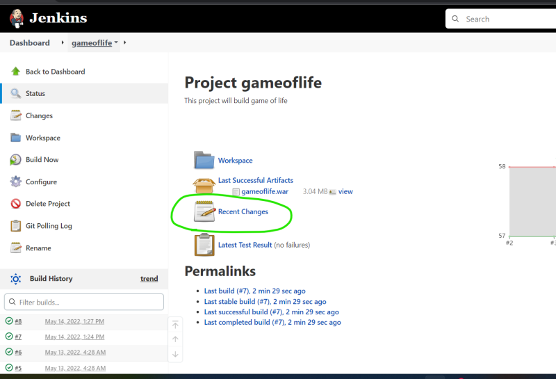

     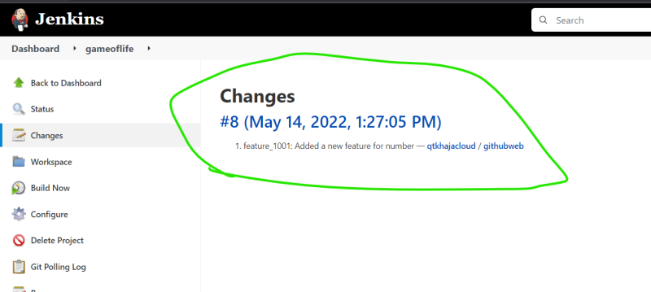

     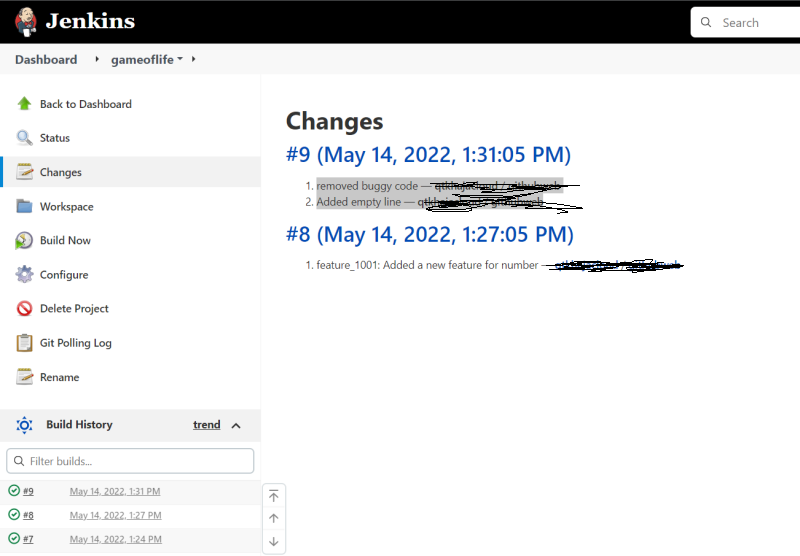

* Configuring day build where we build periodically (every hour, every two hours) etc… 
    * Lets work with some cron schedules
        * Run every day at 11 AM, 7 PM

        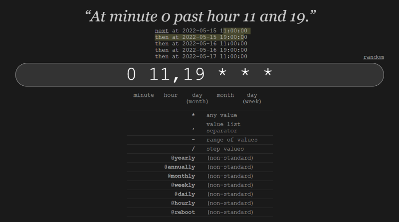

        * Run for every two hours

        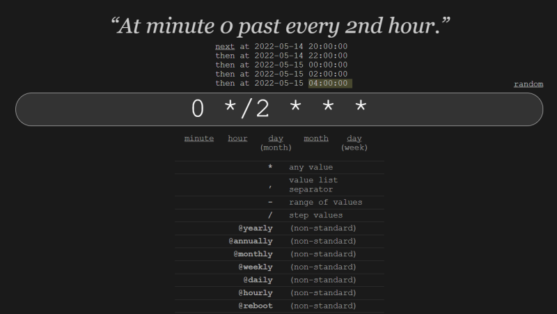

        * Run at 11:00 PM

        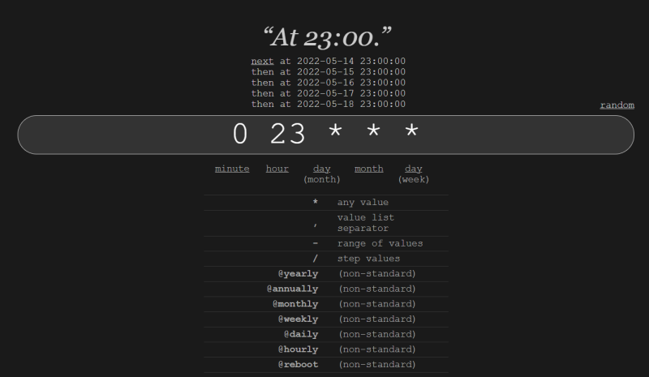

        * Run at 01:00 AM on Saturday and Sunday

        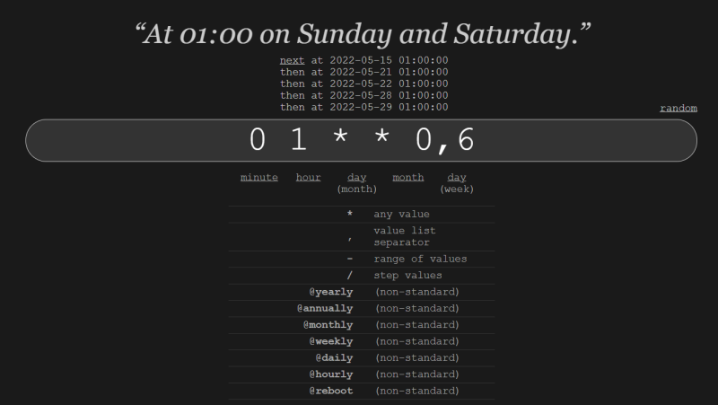

    * Lets configure Jenkins day build to run every hour

    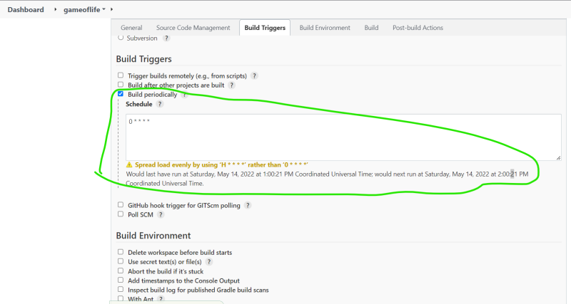

    * If you want to build every hour only when there are new commits then

    

    * [Refer Here](https://crontab.guru/) for cron syntax and experimentation
    * Lets configure the night build to start at 11:00 PM IST on weekdays

    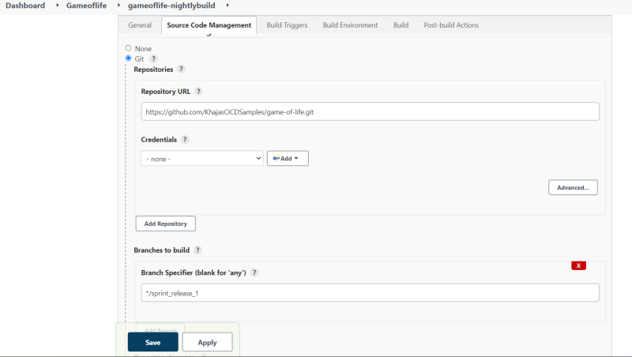

    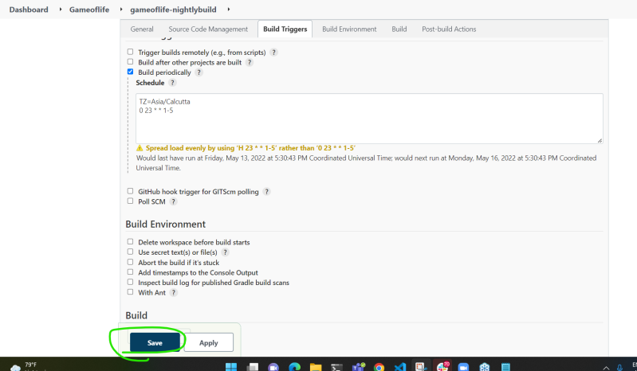

    

### Jenkins Pipelines
* Pipeline as a Code:
    * Build steps expressed in the format of code
    * Jenkins has developed a Domain Specific Language (DSL) based on Groovy Language.
    * Lot of other CI/CD tools are also based on pipelines as a Code
        * Azure DevOps – YAML
        * GitLab – YAML
        * GitHub Actions – YAML
    * Advantages of Pipeline as a code:
        * This pipeline will be part of source code repo, i.e. version will be maintained
        * Branch wise build changes can be handled easily
    * Jenkinsfile:
        * This is the file in which we define pipelines or build steps
        * Earlier the name was supposed to be Jenkinsfile, now it can be any file
    * Pipeline Types:
        * Scripted Pipeline:
            * It is procedure oriented and we can directly use groovy code over here
        * Declarative Pipeline
            * This is declarative and easy to work with

