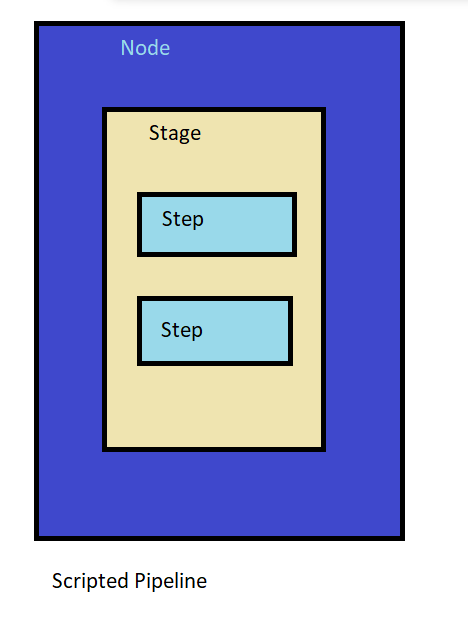
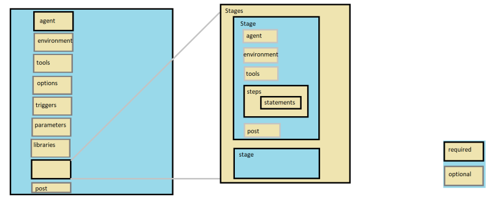

## Scripted Pipelines
* Advantages:
   * Generally few sections and less specifications needed
   * Capability to use more procedural code
   * More like create a program
   * More flexibility to do custom operation

* Disadvantages:
    * More programming required in general
    * Syntax checking limited to Groovy language and environment
    * Looks different from traditional Jenkins model
    * More complex
* Structure:



* Example:

```
node('JDK8') {
    stage('SourceCode') {
        // get the code from git repo on the branch sprint1_develop
        git branch: 'master', url: 'https://github.com/devops-easy/game-of-life.git'
    }

    stage('Build the code') {
        sh 'mvn clean package'
    }

    stage('Archiving and Test Results') {
        junit '**/surefire-reports/*.xml'
        archiveArtifacts artifacts: '**/*.war', followSymlinks: false
    }

}
```
### Declarative Pipelines
* [Refer Here](https://www.jenkins.io/doc/book/pipeline/) for official docs
* [Refer Here](https://www.jenkins.io/doc/book/pipeline/getting-started) for Getting started

* Advantages:
    * More structure
    * More capability to declare what is needed
    * Can be generate from Blue Ocean graphical interface
    * Contains sections that map to tradional jenkins
    * Better syntax checking and error identification

* Disadvantage:
    * Still evolving
    * Iterative logic is less supported

* Structure:



* Pipeline Steps Reference [Refer Here](https://www.jenkins.io/doc/pipeline/steps/)
* Pipeline Syntax reference [Refer Here](https://www.jenkins.io/doc/book/pipeline/syntax/)
* Lets add a daybuild trigger to build the jenkins job whenever there is a new commit by polling scm
* Triggers section [Refer Here](https://www.jenkins.io/doc/book/pipeline/syntax/#triggers)
* JenkinsFile:

```
pipeline {
    agent any
    tools {
        // Install the Maven version configured as "M3" and add it to the path.
        maven "M3"
    }
    triggers { pollSCM('* * * * *') }
    stages {
        stage('SourceCode') {
            steps {
                git branch: 'master', url: 'https://github.com/devops-easy/game-of-life.git'
            }
        }
        stage('Build') {
            steps {
                sh 'mvn clean package -DskipTests'
            }
        }
        stage('Archive the Artifacts') {
            steps {
               archiveArtifacts artifacts: '**/*.war', followSymlinks: false
            }
        }
    }
}


```