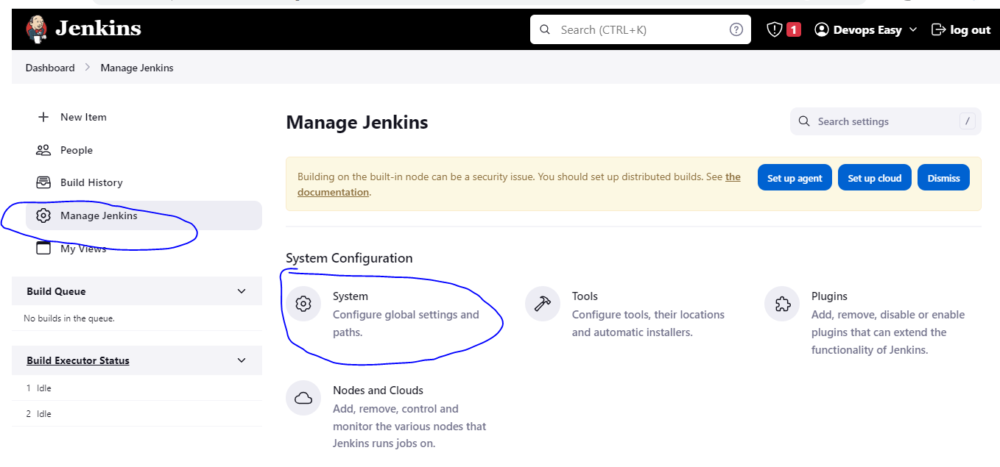
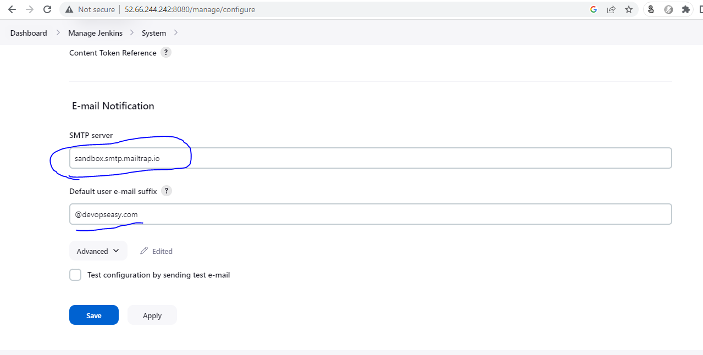
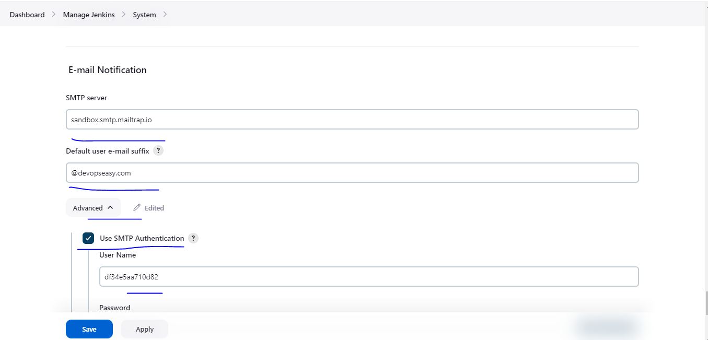
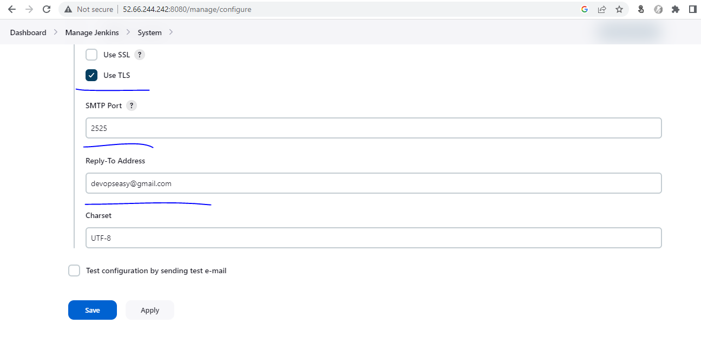
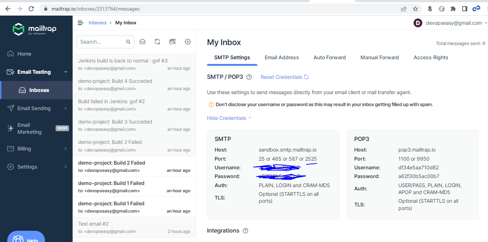
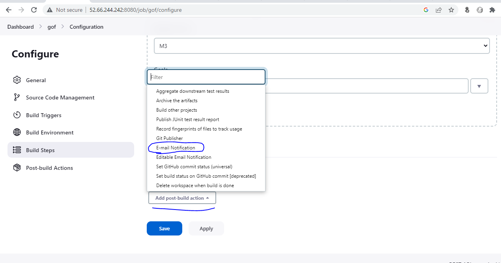
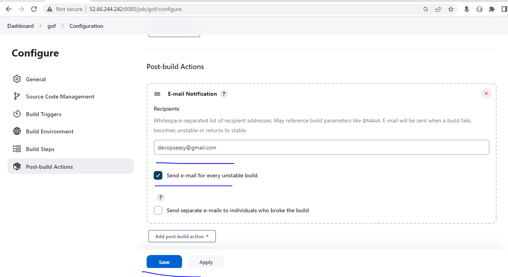

### Working with Jenkins Pipelines
* In jenkins free style projects, when we install plugins we get UI, with Jenkins 2.0 with plugins we get some steps.
* Lets create a declarative pipeline for spring petclinic project

```
pipeline {
    agent any
    tools {
        // Install the Maven version configured as "M3" and add it to the path.
        maven "M3"
    }
    options { 
        timeout(time: 1, unit: 'HOURS')
        retry(2) 
    }
    triggers {
        cron('0 * * * *')
    }
    stages {
        stage('Source Code') {
            steps {
                git url: 'https://github.com/devops-easy/spring-petclinic.git', 
                branch: 'master'
            }

        }
        stage('Build the Code') {
            steps {
                sh script: 'mvn clean package'
            }
        }
        stage('reporting') {
            steps {
                junit testResults: 'target/surefire-reports/*.xml'
            }

        }
    }
    post {
        success {
            // send the success email
            echo "Success"
            mail bcc: '', body: "BUILD URL: ${BUILD_URL} TEST RESULTS ${RUN_TESTS_DISPLAY_URL} ", cc: '', from: 'devops@qtdevops.com', replyTo: '', 
                subject: "${JOB_BASE_NAME}: Build ${BUILD_ID} Succeded", to: 'devopseasy@gmail.com'
        }
        unsuccessful {
            //send the unsuccess email
            mail bcc: '', body: "BUILD URL: ${BUILD_URL} TEST RESULTS ${RUN_TESTS_DISPLAY_URL} ", cc: '', from: 'devops@qtdevops.com', replyTo: '', 
                subject: "${JOB_BASE_NAME}: Build ${BUILD_ID} Failed", to: 'devopseasy@gmail.com'
        }
    }
}
```

## Email Notifications
* For email notifications i will be using fake SMTP [Refer Here](https://mailtrap.io/fake-smtp-server/)
* Configure Email Notifications in Jenkins
* Manage Jenkins => Configure System



* Lets configure a email notification













* To make the email or to know information about the job, Jenkins has environmental variables

* Find a way to include environment variable BUILD_ID and JOB_DISPLAY_URL in the email

```
mail bcc: '', body: 'Build Success', cc: '', 
    from: 'devops@qdevopseasy.com', replyTo: '', 
    subject: 'Build Succeded', to: 'devopseasy@gmail.com'
```

* [Refer Here](https://www.jenkins.io/doc/pipeline/tour/environment/) for the official docs

*  * Environmental variables are built in into jenkins, if you need to create your own varaibles. [Refer Here](https://www.jenkins.io/doc/book/pipeline/jenkinsfile/#using-environment-variables)